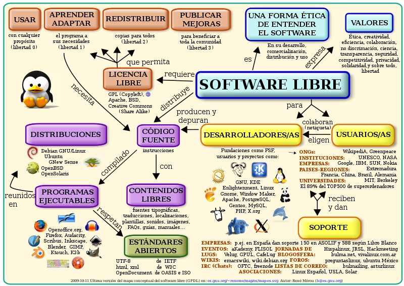

\newpage

# Tipos de Licenciamiento y Propiedad en el Software

## ¿Qué es una Licencia?

Una licencia es un acuerdo legal que establece las condiciones bajo las cuales se puede usar, redistribuir o modificar un software. Es una herramienta que permite a los creadores especificar qué se puede y qué no se puede hacer con su trabajo. El tipo de licencia determina si el software es libre, de código abierto, propietario, entre otros.

## Patentes: Protegiendo la Innovación

Una patente es un conjunto de derechos exclusivos otorgados a un inventor o titular por una entidad gubernamental. Estos derechos permiten al titular de la patente proteger su invención contra la fabricación, venta o uso no autorizado durante un período determinado, generalmente 20 años.

## Copyright o Derecho de Autor: Resguardando la Creatividad

El derecho de autor o "copyright" es una protección legal otorgada a los creadores de obras originales. Estas obras pueden ser literarias, musicales, artísticas, y más. Esta protección otorga al titular el derecho exclusivo de reproducir, distribuir, realizar, mostrar o licenciar su obra, y otros pueden hacerlo solo con permiso explícito del titular.

## El Software Libre: Más Allá del Costo

El software libre promueve la libertad de los usuarios en relación con el software. Esta filosofía otorga a los usuarios el derecho de:

* **Ejecución:** Usar el programa con cualquier propósito.
* **Estudio:** Acceder al código fuente para entender su funcionamiento.
* **Modificación:** Ajustar el software según las necesidades individuales.
* **Redistribución:** Compartir el software, con o sin cambios, para ayudar a otros.

## Código Abierto: Transparencia y Colaboración

El software de código abierto, si bien comparte similitudes con el software libre, se centra en la disponibilidad del código fuente. Los principios que rigen el software de código abierto incluyen:

* **Distribución Libre:** No se deben restringir a nadie la redistribución del software.
* **Acceso al Código Fuente:** El software debe incluir el código fuente o permitir su obtención.
* **Libertad de Modificación:** Se deben permitir modificaciones y trabajos derivados.
* **Preservación de la Integridad:** Los cambios en el código pueden requerir renombrar o cambiar la versión.
* **No Discriminación:** La licencia no puede discriminar contra individuos o grupos.
* **Aplicabilidad Universal:** La licencia no debe restringir el uso del software en ninguna actividad o campo.
* **Distribución de Licencia:** Las licencias deben aplicarse a todos sin necesidad de una licencia adicional.
* **Licencia no Específica a un Producto:** No se debe limitar la licencia a un componente específico del software.
* **No Restrictiva con Otros Software:** El software de código abierto puede ser parte de paquetes de distribución con diferentes licencias.
* **Neutralidad Tecnológica:** No se pueden imponer restricciones basadas en la tecnología usada.

# Estándar Abierto

Basándonos en la definición de Bruce Perens, un estándar abierto es aquel que sigue los siguientes principios:

- **Disponibilidad**: El estándar debe ser accesible libremente y estar disponible para el público.
  
- **Maximizar las opciones del usuario final**: Debe beneficiar y mejorar la experiencia del usuario, otorgándole diversas opciones de uso.
  
- **No hay tasas sobre la implementación**: No debe incurrir en costos adicionales para su implementación.

- **No discriminar al implementador**: Todos los desarrolladores, sin importar quiénes sean, deben tener la misma capacidad para implementar y utilizar el estándar.
  
- **Permiso para extender o restringir**: Se debe poder expandir o limitar el estándar según las necesidades del proyecto.
  
- **Evitar prácticas predatorias por fabricantes dominantes**: Proteger el estándar de ser monopolizado o utilizado de manera desleal por grandes corporaciones.

**Ejemplo de uso**: Los formatos de archivo **.ODT (Open Document Text)** y **.ODS (Open Document Spreadsheet)** son estándares abiertos utilizados por suites ofimáticas como LibreOffice y OpenOffice.

## Software de Dominio Público

Este tipo de software no tiene restricciones de derechos de autor, lo que permite a cualquier persona utilizarlo, modificarlo y distribuirlo como desee.

**Ejemplo**: **SQLite**, una biblioteca que proporciona una base de datos relacional ligera, es software de dominio público.

## Software con Copyleft

Este software es libre, pero su licencia asegura que cualquier modificación o redistribución del mismo también sea libre.

**Ejemplo**: **GNU/Linux** es un sistema operativo con copyleft, garantizando que todas sus variantes y distribuciones sean igualmente libres.

## Software Semi-Libre

Se puede utilizar, copiar, distribuir y modificar, pero generalmente con la restricción de que sea sin fines de lucro.

**Ejemplo**: **Xv**, un visualizador de imágenes para el sistema X Window, permite usos no comerciales.

## Freeware

Programas disponibles para su uso y distribución sin costo, pero no se puede modificar y el código fuente generalmente no está disponible.

**Ejemplo**: **Adobe Acrobat Reader** para leer documentos PDF.

## Shareware

Software que se puede descargar y usar de forma gratuita, pero por un tiempo limitado o con características limitadas.

**Ejemplo**: **WinRAR**, un compresor de archivos, permite a los usuarios probarlo durante un período antes de decidir comprar una licencia.

## Software Privativo

Software que no permite su libre uso, modificación o distribución.

**Ejemplo**: **Microsoft Windows** es un software propietario, es decir, no puedes redistribuirlo o modificarlo sin permiso.

## Software Comercial

Software creado con el objetivo principal de generar ingresos.

**Ejemplo**: **Adobe Photoshop**, una herramienta de edición de imágenes, es software comercial.

\newpage

## Clasificación de Licencias

El siguiente gráfico ilustra cómo diversas licencias interactúan y se superponen, indicando que términos como software libre y de código abierto no son exactamente lo mismo y que el copyleft no es necesariamente un requisito para todas estas licencias:

 
\

El software no es un producto que se compre per se, sino que se *licencia*. Una licencia es el permiso otorgado por el creador o titular de un software para que un tercero realice actividades específicas con él. Esto significa que cuando "compras" software, en realidad estás adquiriendo un conjunto de derechos sobre cómo puedes usarlo. Las licencias de software libre otorgan derechos extensos y abiertos, lo que implica pocas restricciones sobre cómo se puede usar el software. Esta apertura beneficia el progreso y difusión cultural. Hay una amplia gama de licencias disponibles, dependiendo de los derechos que el autor desee otorgar a los usuarios.

### Licencias GPL

Una de las más utilizadas es la Licencia Pública General de GNU (GNU GPL). El autor conserva los derechos de autor (copyright), y permite la redistribución y modificación bajo términos diseñados para asegurarse de que todas las versiones modificadas del software permanecen bajo los términos más restrictivos de la propia GNU GPL. Esto hace que sea imposible crear un producto con partes no licenciadas GPL: el conjunto tiene que ser GPL (**virica**)

Es decir, la licencia GNU GPL posibilita la modificación y redistribución del software, pero únicamente bajo esa misma licencia. Y añade que si se reutiliza en un mismo programa código "A" licenciado bajo licencia GNU GPL y código "B" licenciado bajo otro tipo de licencia libre, el código final "C", independientemente de la cantidad y calidad de cada uno de los códigos "A" y "B", debe estar bajo la licencia GNU GPL.

En la práctica esto hace que las licencias de software libre se dividan en dos grandes grupos, aquellas que pueden ser mezcladas con código licenciado bajo GNU GPL (y que inevitablemente desaparecerán en el proceso, al ser el código resultante licenciado bajo GNU GPL) y las que no lo permiten al incluir mayores u otros requisitos que no contemplan ni admiten la GNU GPL y que por lo tanto no pueden ser enlazadas ni mezcladas con código gobernado por la licencia GNU GPL.

En el sitio web oficial de GNU hay una lista de licencias que cumplen las condiciones impuestas por la GNU GPL y otras que no.

Aproximadamente el 60% del software licenciado como software libre emplea una licencia GPL o de manejo.

### Licencias AGPL

La Licencia Pública General de Affero (en inglés Affero General Public License, también Affero GPL o AGPL) es una licencia copyleft derivada de la Licencia Pública General de GNU diseñada específicamente para asegurar la cooperación con la comunidad en el caso de software que funcione en servidores de red.

La Affero GPL es íntegramente una GNU GPL con una cláusula nueva que añade la obligación de distribuir el software si éste se ejecuta para ofrecer servicios a través de una red de ordenadores.

La Free Software Foundation recomienda que el uso de la GNU AGPLv3 sea considerado para cualquier software que usualmente corra sobre una red.

### Licencias estilo BSD

Llamadas así porque se utilizan en gran cantidad de software distribuido junto a los sistemas operativos BSD. El autor, bajo tales licencias, mantiene la protección de copyright únicamente para la renuncia de garantía y para requerir la adecuada atribución de la autoría en trabajos derivados, pero permite la libre redistribución y modificación, incluso si dichos trabajos tienen propietario. Son muy permisivas, tanto que son fácilmente absorbidas al ser mezcladas con la licencia GNU GPL con quienes son compatibles. Puede argumentarse que esta licencia asegura “verdadero” software libre, en el sentido que el usuario tiene libertad ilimitada con respecto al software, y que puede decidir incluso redistribuirlo como no libre. Otras opiniones están orientadas a destacar que este tipo de licencia no contribuye al desarrollo de más software libre (normalmente utilizando la siguiente analogía: "una licencia BSD es más libre que una GPL si y sólo si se opina también que un país que permita la esclavitud es más libre que otro que no la permite").

### Licencias estilo MPL y derivadas (Mozilla Public License)

Esta licencia es de Software Libre y tiene un gran valor porque fue el instrumento que empleó Netscape Communications Corp. para liberar su Netscape Communicator 4.0 y empezar ese proyecto tan importante para el mundo del Software Libre: Mozilla. Se utilizan en gran cantidad de productos de software libre de uso cotidiano en todo tipo de sistemas operativos. La MPL es Software Libre y promueve eficazmente la colaboración evitando el efecto "viral" de la GPL (si usas código licenciado GPL, tu desarrollo final tiene que estar licenciado GPL). Desde un punto de vista del desarrollador la GPL presenta un inconveniente en este punto, y lamentablemente mucha gente se cierra en banda ante el uso de dicho código. No obstante la MPL no es tan excesivamente permisiva como las licencias tipo BSD. Estas licencias son denominadas de copyleft débil. La NPL (luego la MPL) fue la primera licencia nueva después de muchos años, que se encargaba de algunos puntos que no fueron tomados en cuenta por las licencias BSD y GNU. En el espectro de las licencias de software libre se la puede considerar adyacente a la licencia estilo BSD, pero perfeccionada.
Copyleft

El titular de los derechos de autor (copyright) de un software bajo licencia copyleft puede también realizar una versión modificada bajo su copyright original, y venderla bajo cualquier licencia que desee, además de distribuir la versión original como software libre. Esta técnica ha sido usada como un modelo de negocio por una serie de empresas que realizan software libre (por ejemplo *MySQL*); esta práctica no restringe ninguno de los derechos otorgados a los usuarios de la versión copyleft.

En España, toda obra derivada está tan protegida como una original, siempre que la obra derivada parta de una autorización contractual con el autor. En el caso genérico de que el autor retire las licencias "copyleft", no afectaría de ningún modo a los productos derivados anteriores a esa retirada, ya que no tiene efecto retroactivo. En términos legales, el autor no tiene derecho a retirar el permiso de una licencia en vigencia. Si así sucediera, el conflicto entre las partes se resolvería en un pleito convencional.

 
\

\newpage

## Sistemas Operativos Libres

Los sistemas operativos libres ofrecen una libertad de uso, distribución y modificación, además de acceso transparente a su código fuente. Esto posibilita la adaptación, mejora y redistribución del sistema según las necesidades de los usuarios. Un excelente ejemplo de esto es **Debian**, el cual es tanto gratuito como libre. Sin embargo, es crucial entender que "libre" no necesariamente se traduce como "gratuito", ya que se refiere a la libertad de uso y modificación, no al costo.

**Ejemplo**: **Fedora** y **Ubuntu** son otros ejemplos populares de sistemas operativos libres.

## Licencias de los Sistemas Operativos Propietarios

Los sistemas operativos propietarios o comerciales vienen acompañados de distintas modalidades de licencias, limitando la forma en que el usuario puede utilizar el software. Estas licencias pueden variar según el uso previsto, la cantidad de dispositivos y otras circunstancias. A continuación, se detallan algunos tipos comunes de licencias:

### O.E.M. (Original Equipment Manufacturer)

Este tipo de licencia se otorga directamente a los fabricantes de hardware. Cuando adquirimos un dispositivo, a menudo viene preinstalado con software bajo licencia OEM. La peculiaridad de estas licencias es que están vinculadas específicamente al hardware inicial, limitando la reutilización en otros dispositivos. A menudo son más asequibles pero vienen con restricciones y sin accesorios adicionales como manuales o cajas.

**Ejemplo**: Un **Dell** o **HP** que compra con Windows preinstalado.

### RETAIL

Con una licencia Retail, adquieres directamente la licencia del desarrollador. Esto te da el derecho de instalar y usar el software en cualquier dispositivo compatible, transferir o incluso revender la licencia. Suelen venir con embalaje completo, incluyendo caja y manuales, y están diseñadas para ser utilizadas en una única máquina a la vez.

**Ejemplo**: Comprar una copia física de **Windows 10** en una tienda.

### VLM (Licencias por Volumen)

Estas licencias son ideales para empresas o instituciones que necesitan administrar múltiples dispositivos. Permiten instalar y activar el software en un número predefinido de dispositivos usando una única clave. Aunque son más caras en total, ofrecen ahorros significativos en comparación con la adquisición individual de licencias.

**Ejemplo**: Una empresa que compra licencias para **Windows** para 100 computadoras de empleados.

### MSDN (Licencias de Educación)

Microsoft ofrece licencias de educación bajo su programa MSDN. Están destinadas a entornos educativos, formación y desarrollo, y no deben usarse para fines comerciales. Esto permite que instituciones educativas y desarrolladores tengan acceso a herramientas y sistemas a costos reducidos.

**Ejemplo**: Un estudiante que utiliza una versión de **Windows** o **Visual Studio** bajo una licencia MSDN para proyectos académicos.

\ 
